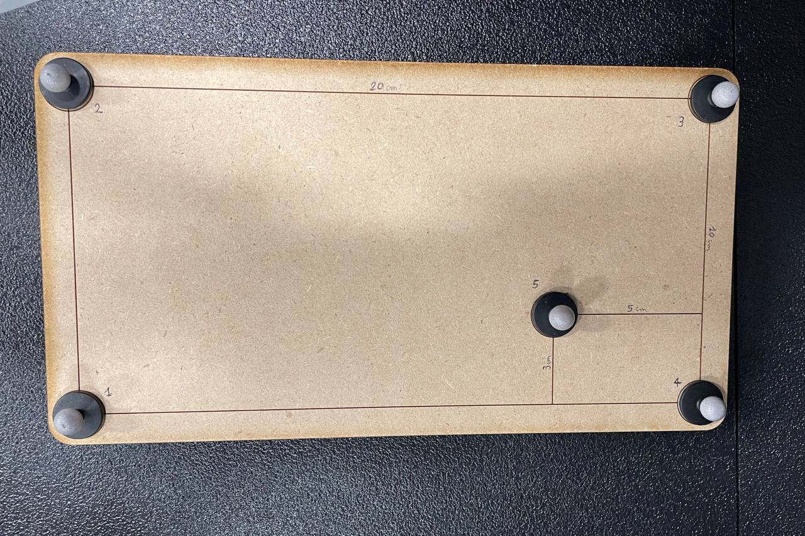

# A Robust Filter for Marker-less Multi-person Tracking in Human-Robot Interaction Scenarios
Collection of ROS nodes for 3D marker-less human pose estimation from single RGB-D camera and marker-less wrist following.

Please check our
[project page](https://penn-figueroa-lab.github.io/markerless-human-perception/)
and the [explanation video](https://penn-figueroa-lab.github.io/markerless-human-perception/).
## Nodes Installation

```
git clone https://github.com/penn-figueroa-lab/markerless-human-perception.git
cd markerless-human-perception
git clone git@github.com:PARCO-LAB/COMETH.git
source /opt/ros/noetic/setup.bash
catkin_make
source devel/setup.bash
```

### Camera stream
Connect the Realsense camera to the PC and run with the correct launchfile:

```
roslaunch realsense2_camera data/rs_d455_rmhri.launch
```

## Passive Velocity Controller
We use the default PassiveDS Controller from the [franka_interactive_controller](https://github.com/penn-figueroa-lab/franka_interactive_controllers) repository. Follow the steps in the link to complete the setup. Then launch:

```
roslaunch franka_interactive_controllers franka_interactive_bringup.launch
```

## Calibration 
We prepared a set of scripts usefull for retrieving 4x4 RT matrices to transform a point from the franka coordinate system and the camera coordinate system to the Optitrack one.
<!--  -->


The dwg file of calibration board used to perform the calibration can be found [here](data/calib_board.dwg).


### Optitrack calibration board (ground truth)
Turn on the OptiTrack device. Turn on the Motive app, load the calibration file.
Then, run the [modified version](https://github.com/hparekh15/natnet_ros_cpp) of natnet_ros_cpp:

```
roslaunch natnet_ros_cpp natnet_ros.launch
```


<!-- ### Camera stream
On the PC connected to the robot, launch the two camera streams:
```
roslaunch realsense2_camera rs_d435_rmhri.launch
roslaunch realsense2_camera rs_d455_rmhri.launch
```

On PC1 run the real-time 3D pose estimator (i.e., OpenPose):
```
cd scritps
python3 human_pose_estimator.py
``` -->

## Citation
If you are going to use some of these nodes for a scientific research, please cite the work below:
```
@inproceedings{Martini2024,
  title={A Robust Filter for Marker-less Multi-person Tracking in Human-Robot Interaction Scenarios},
  author={Martini, Enrico and Parekh, Harshil and Peng, Shaoting and Bombieri, Nicola and Figueroa, Nadia},
  booktitle={2024 33nd IEEE International Conference on Robot and Human Interactive Communication (RO-MAN)},
  pages={1-6},
  year={2024},
  organization={IEEE}
}
```